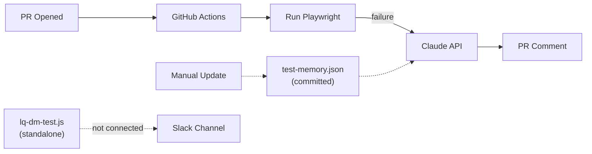
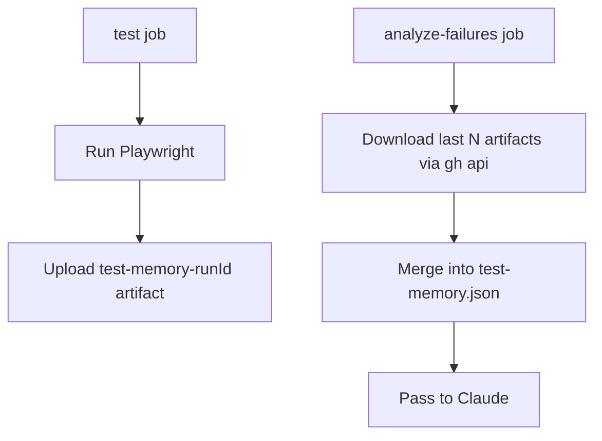
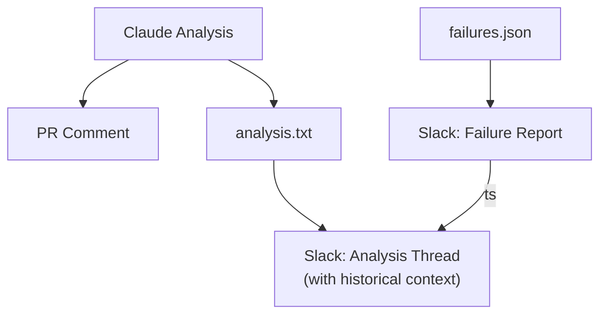
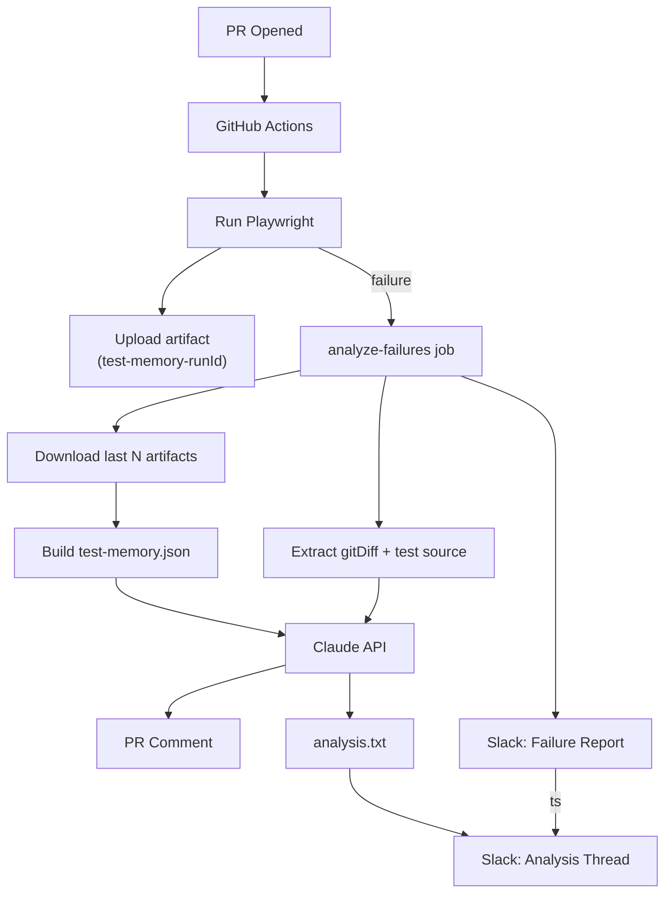

# Little QA — Project Roadmap

## Current State

The repo has three disconnected pieces:

- **GitHub Actions workflow** (`[.github/workflows/playwright.yml](.github/workflows/playwright.yml)`) — runs Playwright E2E tests on PRs, calls Claude to analyze failures, posts a PR comment.
- **Slack script** (`[lq-dm-test.js](lq-dm-test.js)`) — standalone Node script that reads `results.json` and posts a Block Kit failure report to Slack. Not wired into the workflow. Hardcoded bot token. Expects a different file format than what the workflow produces.
- **Test memory** (`[test-memory.json](test-memory.json)`) — a manually-committed ~1.5MB JSON file of historical Playwright runs. The workflow reads it but never writes to it.




---

## Phase 0: Fix Foundational Issues

**Goal:** Patch the three broken things that prevent the existing pieces from working together. Quick wins that unblock everything else.

### Changes

- **Move secrets out of code** — replace the hardcoded `slackBotToken` and `channelId` in `[lq-dm-test.js](lq-dm-test.js)` with `process.env.SLACK_BOT_TOKEN` and `process.env.SLACK_CHANNEL_ID`. Add corresponding secrets in the GitHub repo settings.
- **Fix the file format mismatch** — the workflow outputs `test-results.json` (Playwright JSON reporter format with `suites[].specs[].tests[].results[]`) but `lq-dm-test.js` reads `results.json` expecting `data.tests`. Refactor the script to consume the Playwright format directly.
- **Wire the script into the workflow** — add a `notify-slack` job to `[playwright.yml](.github/workflows/playwright.yml)` that runs after `analyze-failures`, downloads the `playwright-report-json` artifact, installs Node, and runs `node lq-dm-test.js`.

### Result

The Slack script becomes a functioning part of the CI pipeline instead of a disconnected standalone file.

---

## Phase 1: Persistent Test Memory

**Goal:** Replace the static `test-memory.json` file with automated storage that updates after every CI run.

### Approach: GitHub Action Artifacts

Artifacts are the best fit here — they're durable, inspectable in the GitHub UI, and require no external infrastructure.

### Changes

- **Store test results as artifacts** — after each E2E run, upload `test-results.json` as a named artifact with a timestamp or run ID (e.g. `test-memory-{run_id}`).
- **Build a composite test memory** — at the start of the `analyze-failures` job, use the GitHub API (`gh api /repos/{owner}/{repo}/actions/artifacts`) to download the last N artifacts (e.g. 10) and merge them into a single `test-memory.json` using `jq`.
- **Remove manual `test-memory.json` updates** — the repo no longer needs a committed JSON file. Remove `test-memory.json` from the repo and add it to `.gitignore`. History lives in artifacts.
- **Fallback** — if no prior artifacts exist (first run), gracefully skip historical analysis by creating an empty `history.json`.

### Result




---

## Phase 2: Codebase-Aware Claude Analysis

**Goal:** Give Claude access to the relevant code and commits so it can explain *why* a failure is happening, not just *what* failed.

### Changes

- **Extract the git diff from Playwright metadata** — the Playwright JSON report already includes `gitDiff` in its `metadata` field. Extract it with `jq '.metadata.gitDiff // empty'` instead of running separate git commands. This is cleaner since the data is already captured at test time.
- **Include the failing test source** — read the spec file content for each failing test (e.g. `tests/login.spec.ts`) and pass it to Claude so it can identify issues like typos in locators, wrong URLs, or missing assertions.
- **Include page/component source if available** — if the repo grows to include application code, pass relevant source files to the prompt as well.
- **Enrich the Claude prompt** — add two new sections:
  - `Recent changes:` with the extracted `gitDiff`
  - `Relevant test source:` with the contents of failing spec files
- **Update the prompt instructions** — tell Claude: "If recent changes modified a locator, selector, or URL that a failing test depends on, mention the specific change and what it affected."
- **Keep the output concise** — same structured format: **Test Name** — explanation, with an added line noting which commit or change likely caused the failure.
- **Increase `max_tokens`** to ~2048 to accommodate richer analysis.

### Updated Prompt Shape

```
You are analyzing Playwright test failures...

Current failures:
<failures.json>

Historical runs (most recent 5):
<history.json>

Recent changes (git diff):
<gitDiff from Playwright metadata>

Relevant test source:
<contents of failing .spec.ts files>

If recent changes modified a locator, selector, or URL that a failing test
depends on, mention the specific change and what it affected.
Do not suggest fixes. Do not include headings or titles.
```

---

## Phase 3: Polished Slack Integration with Threaded Analysis

**Goal:** Evolve the Slack notifications from basic failure alerts into a threaded, conversational experience with Little QA.

### Primary Message Improvements

- **Enrich the Block Kit message** — include the actual error message per failure (not a generic "Assertion Error"), PR title and link, commit author, total passed/failed/skipped counts, and a timestamp.
- **Clean up message formatting** — use Slack Block Kit sections with mrkdwn for structured, readable messages.

### Threaded Analysis

- **Capture the message `ts`** — after `chat.postMessage` succeeds, extract `result.ts` (the Slack message timestamp used as a thread ID).
- **Post a threaded reply** — make a second `chat.postMessage` call with `thread_ts` set to the parent message's `ts`. The body is the Claude analysis (the same content posted as a PR comment).
- **Historical context in thread** — if a test has been failing across multiple runs, include that in the thread reply (e.g. "This test has failed in 4 of the last 5 runs"). This data already exists from the Claude analysis.
- **Format the thread message** — use Slack mrkdwn: bold test names, inline code for locators, and a footer noting "Analyzed by Claude."

### Implementation

Refactor `[lq-dm-test.js](lq-dm-test.js)` to support two modes via CLI flags:

```yaml
- name: Post failure report to Slack
  id: slack-report
  env:
    SLACK_BOT_TOKEN: ${{ secrets.SLACK_BOT_TOKEN }}
    SLACK_CHANNEL_ID: ${{ secrets.SLACK_CHANNEL_ID }}
  run: node lq-dm-test.js --report --output-ts slack-ts.txt

- name: Post analysis thread to Slack
  env:
    SLACK_BOT_TOKEN: ${{ secrets.SLACK_BOT_TOKEN }}
    SLACK_CHANNEL_ID: ${{ secrets.SLACK_CHANNEL_ID }}
  run: node lq-dm-test.js --thread --ts-file slack-ts.txt --analysis analysis.txt
```

### Result




---

## Phase 4: Smarter Memory and Trends

**Goal:** Move beyond raw result storage to track patterns over time.

### Changes

- **Structured test history** — migrate from raw JSON artifacts to a lightweight structured format (GitHub Pages JSON, a gist, or a simple SQLite in artifacts) that tracks per-test pass/fail over time.
- **Flaky test detection** — use the historical memory to flag tests that alternate pass/fail and tag them as flaky in both the PR comment and Slack thread.
- **Trend tracking** — identify tests whose failure rate is increasing, and surface that in the Claude analysis ("This test's failure rate has increased from 20% to 80% over the last 10 runs").
- **Success/recovery notifications** — post a short green message to Slack when all tests pass, especially if previous runs had failures (recovery notification).
- **Scheduled runs** — add a `schedule` trigger (e.g. nightly cron) to the workflow so tests run against `main` regularly, not just on PRs.

---

## End-State Architecture




