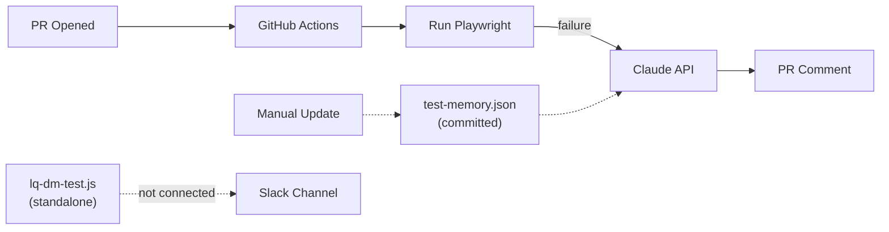
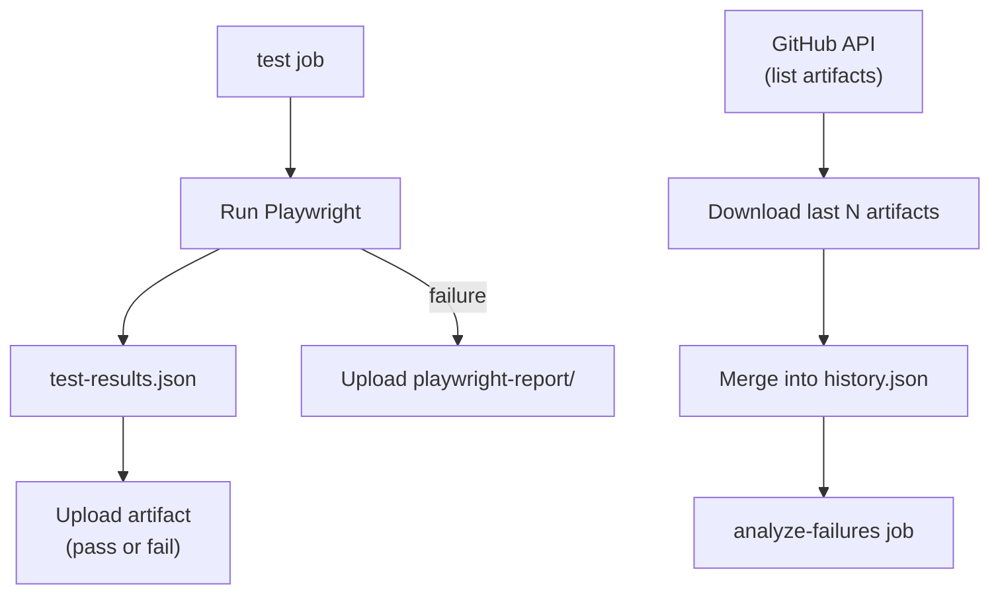
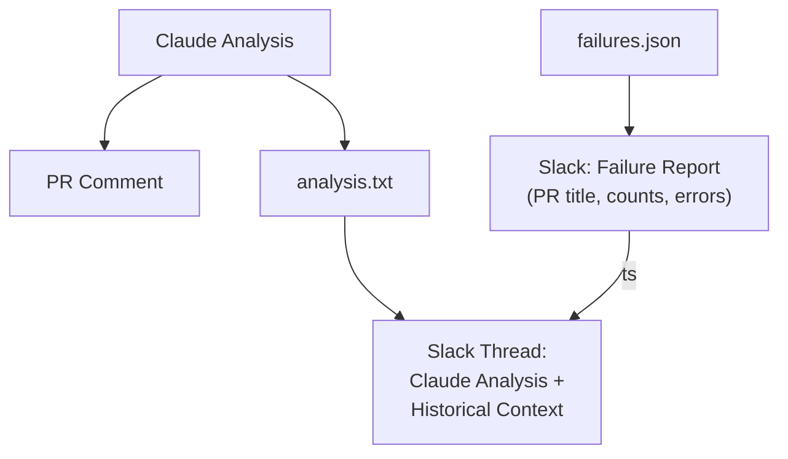
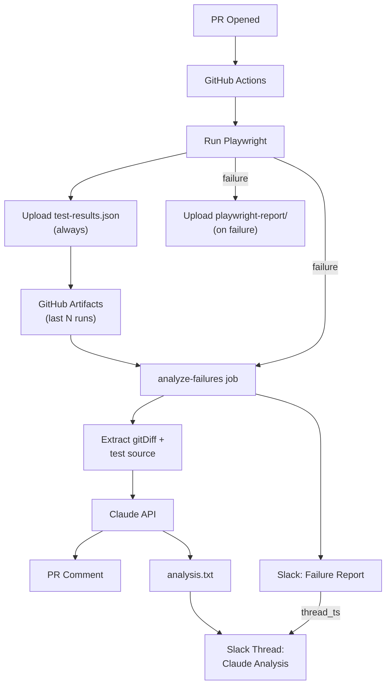

# Little QA — Project Roadmap 

## Current State

The repo has three disconnected pieces:

- **GitHub Actions workflow** (`[.github/workflows/playwright.yml](.github/workflows/playwright.yml)`) — runs Playwright E2E tests on PRs, calls Claude to analyze failures, posts a PR comment.
- **Slack script** (`[lq-dm-test.js](lq-dm-test.js)`) — standalone Node script that reads `results.json` and posts a Block Kit failure report to Slack. Not wired into the workflow. Hardcoded bot token. Expects a different file format than what the workflow produces.
- **Test memory** (`[test-memory.json](test-memory.json)`) — a manually-committed ~1.5MB JSON file of historical Playwright runs. The workflow reads it but never writes to it.




---

## Phase 0: Fix Foundational Bugs

**Goal:** Patch the three broken things that prevent new features from working.

### Changes

- **Move secrets out of code** — replace the hardcoded `slackBotToken` and `channelId` in `lq-dm-test.js` with environment variables (`SLACK_BOT_TOKEN`, `SLACK_CHANNEL_ID`), sourced from GitHub Actions secrets.
- **Fix the file format mismatch** — the workflow outputs `test-results.json` (Playwright JSON reporter format with `suites[].specs[].tests[].results[]`) but `lq-dm-test.js` reads `results.json` with a `data.tests` shape. Refactor the script to consume the Playwright format directly.
- **Wire the Slack script into the workflow** — add a `notify-slack` job to `playwright.yml` that runs after `analyze-failures`, downloads the `playwright-report-json` artifact, and executes `node lq-dm-test.js`.

---

## Phase 1: Persistent Test Memory via Artifacts

**Goal:** Replace the manually-committed `test-memory.json` with automated artifact storage that updates after every CI run.

### Changes

- **Upload artifacts on every run (pass or fail)** — after each E2E run, upload `test-results.json` as a named artifact with a timestamp or run ID (e.g. `test-results-{run_id}`). Upload on both success and failure so the historical record is complete.
- **Also upload `playwright-report/` on failure** — ensure the HTML report artifact is always available when tests fail, so the "View Full Report" link in Slack works and developers can debug visually.
- **Build composite test memory** — at the start of the `analyze-failures` job, use the GitHub API (`gh api /repos/{owner}/{repo}/actions/artifacts`) to download the last N artifacts (e.g. 10), then merge them into a single `history.json` for Claude.
- **Remove the committed file** — delete `test-memory.json` from the repo and add it to `.gitignore`. History now lives entirely in artifacts.
- **Fallback** — if no prior artifacts exist (first run), gracefully skip historical analysis instead of failing.

### Result




---

## Phase 2: Codebase-Aware Claude Analysis

**Goal:** Give Claude access to the relevant code and commits so it can explain *why* a failure is happening, not just *what* failed.

### Changes

- **Extract the git diff from Playwright metadata** — the Playwright JSON report already includes `gitDiff` in its `metadata` field. Extract it with `jq '.metadata.gitDiff'` rather than running separate git commands. This is cleaner and captures exactly what changed between the base and head of the PR.
- **Include the failing test source** — for each failing spec file (e.g. `tests/login.spec.ts`), read its contents and pass it to Claude so it can identify issues like typos in locators, wrong URLs, or missing assertions.
- **Include page/component source if available** — if the repo grows to include application code, pass relevant source files to the prompt as well.
- **Keep the output concise** — prompt Claude to use the same structured format: **Test Name** -- one-sentence explanation, with an added line noting which commit or change likely caused the failure.
- **Increase `max_tokens`** to ~2048 to accommodate the richer context.

### Updated Prompt Shape

```
You are analyzing Playwright test failures...

Current failures:
<failures.json>

Historical runs (most recent 5):
<history.json>

Git diff from this PR:
<gitDiff from Playwright metadata>

Relevant test source:
<contents of failing .spec.ts files>

If a change in the diff altered a locator, selector, or URL that a failing test depends on,
mention the specific change and what it affected.
...
```

---

## Phase 3: Polished Slack Integration with Threaded Analysis

**Goal:** Evolve Slack notifications from basic failure alerts into a threaded, conversational experience with Little QA.

### Primary Message

Post a summary to the configured Slack channel when tests fail, using Block Kit:

- PR title and link
- Total passed / failed / skipped count
- List of failed test names with actual error messages (not generic "Assertion Error")
- "View Full Report" button linking to the Playwright report

### Threaded Analysis

After posting the primary message:

- **Capture the message `ts`** — extract `result.ts` from the `chat.postMessage` response (Slack uses this as a thread identifier).
- **Post Claude's analysis as a thread reply** — make a second `chat.postMessage` with `thread_ts` set to the parent `ts`. The body is the same concise analysis posted to the PR comment: bold test names, one-sentence explanations, no fix suggestions.
- **Include historical context in the thread** — if a test has been failing across multiple runs, note it (e.g. "This test has failed in 4 of the last 5 runs. This is a recurring error.").
- **Format with Slack mrkdwn** — bold test names, inline code for locators, and a footer: "Analyzed by Claude."

### Refactor `lq-dm-test.js`

Export two functions (`postFailureReport`, `postAnalysisThread`) and support CLI flags so the workflow can call them in sequence:

```yaml
- name: Post failure report to Slack
  id: slack-report
  env:
    SLACK_BOT_TOKEN: ${{ secrets.SLACK_BOT_TOKEN }}
    SLACK_CHANNEL_ID: ${{ secrets.SLACK_CHANNEL_ID }}
  run: node lq-dm-test.js --report --output-ts slack-ts.txt

- name: Post analysis thread to Slack
  env:
    SLACK_BOT_TOKEN: ${{ secrets.SLACK_BOT_TOKEN }}
    SLACK_CHANNEL_ID: ${{ secrets.SLACK_CHANNEL_ID }}
  run: node lq-dm-test.js --thread --ts-file slack-ts.txt --analysis analysis.txt
```

### Success Notifications

Optionally post a short green message when all tests pass, especially if previous runs had failures (recovery notification).

### Result




---

## Phase 4: Smarter Memory and Trends

**Goal:** Move beyond raw result storage to track patterns over time.

- **Structured test history** — migrate from raw JSON artifacts to a lightweight store (GitHub Pages JSON, a gist, or a simple SQLite file in artifacts) that tracks per-test pass/fail over time.
- **Flaky test detection** — use historical data to flag tests that alternate pass/fail. Tag them as flaky in both the PR comment and Slack thread.
- **Trend reporting** — surface trends like "login.spec.ts has regressed over the last 3 runs" or "all tests have been passing for 10 runs."
- **Scheduled runs** — add a `schedule` trigger (e.g. nightly cron) to the workflow so tests run against `main` regularly, not just on PRs.
- **Slash command** — add a Slack slash command (`/littleqa status`) that queries the latest test memory and returns a summary without needing to open GitHub.
- **Report dashboard** — enhance the GitHub Pages deployment to show a historical pass/fail chart built from test memory data.

---

## End-State Architecture




